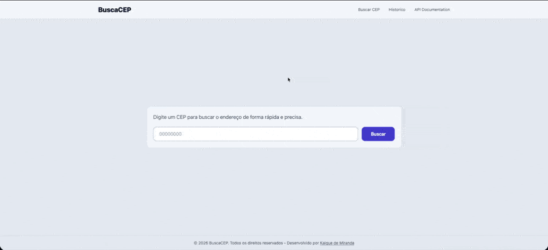
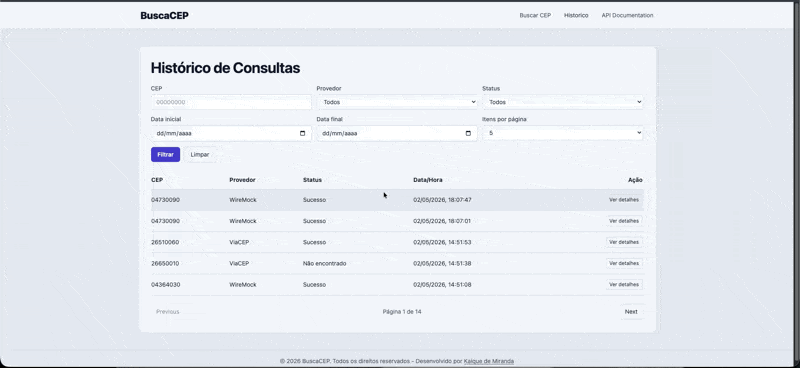
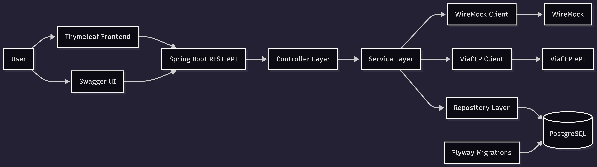
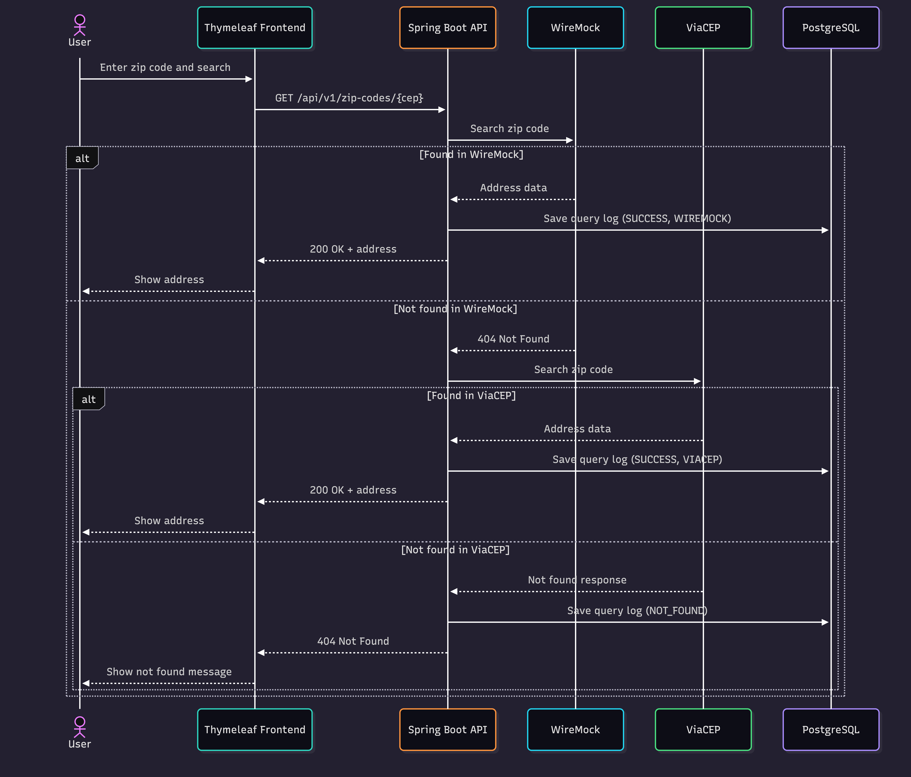

# Zip Code Search API

REST API and Thymeleaf frontend for Brazilian zip code lookup. The application queries WireMock first, falls back to ViaCEP when needed, and persists every query result for traceability.

## Overview

Lookup flow:

1. Search in WireMock (primary provider).
2. If not found, search in ViaCEP (fallback provider).
3. Persist the query result (success, not found, or error) in PostgreSQL.

This strategy provides deterministic local behavior for development and testing while still supporting real external lookups.

## Demo

### Zip Code Search


### Query History


## Architecture

### High-level architecture


### Search flow


## Tech Stack

- Java 21
- Spring Boot 4
- Spring Web
- Spring Data JPA
- Flyway
- PostgreSQL
- Docker / Docker Compose
- WireMock
- ViaCEP
- Thymeleaf
- Tailwind CSS
- Swagger (`springdoc-openapi`)
- JUnit / Mockito / H2

## Features

- Zip code search
- WireMock as primary provider
- ViaCEP fallback
- Query logging
- Pagination and filtering
- Frontend UI
- Copy actions
- Swagger documentation

## API Endpoints

Base URL: `http://localhost:8080`

### GET /api/v1/zip-codes/{cep}

- Accepts formatted and unformatted zip codes (`99999-999` or `99999999`)
- Responses: `200`, `400`, `404`, `502`

```bash
curl http://localhost:8080/api/v1/zip-codes/04730090
```

Example `200 OK` response:

```json
{
  "cep": "04730-090",
  "logradouro": "Avenida das Nações Unidas",
  "complemento": "de 1000 a 1598 - lado par",
  "bairro": "Várzea de Baixo",
  "localidade": "Sao Paulo",
  "uf": "SP"
}
```

### GET /api/v1/zip-code-queries

- Supports pagination (`page`, `size`)
- Supports filters:
  - `cep`
  - `status`
  - `provider`
  - `dateFrom`
  - `dateTo`

```bash
curl -G "http://localhost:8080/api/v1/zip-code-queries" \
  --data-urlencode "page=0" \
  --data-urlencode "size=10" \
  --data-urlencode "provider=WIREMOCK" \
  --data-urlencode "status=SUCCESS" \
  --data-urlencode "dateFrom=2026-04-01T00:00:00" \
  --data-urlencode "dateTo=2026-04-30T23:59:59"
```

### GET /api/v1/zip-code-queries/{externalId}

- Returns detailed query log by external UUID

```bash
curl http://localhost:8080/api/v1/zip-code-queries/5dbf0be0-77ff-4c5d-a69f-d8452d58fbd2
```

## How to Run

```bash
cp .env.example .env
docker compose up --build
```

Stop containers:

```bash
docker compose down
docker compose down -v
```

## Useful URLs

- App: [http://localhost:8080/](http://localhost:8080/)
- Swagger: [http://localhost:8080/swagger-ui.html](http://localhost:8080/swagger-ui.html)
- OpenAPI: [http://localhost:8080/v3/api-docs](http://localhost:8080/v3/api-docs)
- History: [http://localhost:8080/history](http://localhost:8080/history)
- Actuator health (if available): [http://localhost:8080/actuator/health](http://localhost:8080/actuator/health)

## Environment Variables

| Variable | Description | Example |
|---|---|---|
| `POSTGRES_DB` | PostgreSQL database name | `buscacep` |
| `POSTGRES_USER` | PostgreSQL user | `buscacep` |
| `POSTGRES_PASSWORD` | PostgreSQL password | `buscacep` |
| `SPRING_DATASOURCE_URL` | JDBC datasource URL used by the app | `jdbc:postgresql://postgres:5432/buscacep` |
| `SPRING_DATASOURCE_USERNAME` | JDBC username | `buscacep` |
| `SPRING_DATASOURCE_PASSWORD` | JDBC password | `buscacep` |
| `SPRING_JPA_HIBERNATE_DDL_AUTO` | Hibernate schema strategy | `validate` |
| `SPRING_FLYWAY_ENABLED` | Enables Flyway migrations at startup | `true` |
| `CEP_CLIENT_WIREMOCK_URL` | WireMock base URL | `http://wiremock:8080` |
| `CEP_CLIENT_VIACEP_URL` | ViaCEP base URL | `https://viacep.com.br/ws` |
| `APP_PORT` | Published application port | `8080` |

## Technical Decisions

- **WireMock + ViaCEP:** WireMock is the primary provider for predictable local behavior, and ViaCEP is used as fallback for non-mocked zip codes.
- **`BIGSERIAL` + `external_id` UUID:** Numeric primary key is efficient for indexing and internal ordering, while UUID is safer to expose publicly.
- **`JSONB`:** Provider response payload is stored in `response_body` with flexible schema.
- **Custom `PageResponse`:** Avoids exposing Spring Data internal page models directly in API contracts.
- **Fallback strategy:** Tries local mocked data first, then external provider, and logs outcomes consistently.

## SOLID Principles

- **SRP (Single Responsibility Principle):** Controllers handle HTTP, services handle business rules and fallback flow, clients handle external provider integrations.
- **DIP (Dependency Inversion Principle):** Service layer depends on abstractions and provider-specific clients are isolated.
- **OCP (Open/Closed Principle):** Provider strategy can be extended with new providers without changing endpoint contracts.

## Project Structure

```text
.
├── Dockerfile
├── docker-compose.yml
├── docker-compose.mock.yml
├── .env.example
├── wiremock/
│   └── mappings/
├── src/
│   ├── main/
│   │   ├── java/io/github/kbdemiranda/zipcode/search/
│   │   │   ├── client/
│   │   │   ├── config/
│   │   │   ├── controller/
│   │   │   ├── dto/
│   │   │   ├── exception/
│   │   │   ├── model/
│   │   │   ├── repository/
│   │   │   │   └── specification/
│   │   │   └── service/
│   │   └── resources/
│   │       ├── application.yaml
│   │       ├── db/migration/
│   │       └── templates/
│   └── test/
│       └── java/io/github/kbdemiranda/zipcode/search/
└── pom.xml
```

## Testing

The project includes:

- Unit tests for service and controller behaviors.
- Integration tests using H2.

Run tests:

```bash
./mvnw test
```

## Future Improvements

- Add caching for frequent zip code queries.
- Add rate limiting for public endpoints.
- Add authentication and authorization.
- Replace Thymeleaf frontend with a SPA frontend.

## Final Note

This project was developed as a technical challenge focusing on clean architecture, resilience, and ease of local execution.
